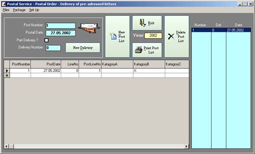



## ThePostman

### Description

I wrote this small application some months ago for my company and we use it for submitting of a postal list of all our outgoing mail and packages to the nearby postal office.

The advantage using this program in comparison with a manually filled post list, is the sender do not have to have the weight of all the various shipments, first time it is shipped it is weighed and the weight along with a descriptive text goes into a database for later use.

This source code is yours for the taking, do not bother to give any votes – but I would be very grateful for any feedback, positive or negative.

Have a nice day
 
### More Info
 

             |
---                |---
**Submitted On**   |2002-05-27 15:03:50
**By**             |[Jorgen Levesen](https://github.com/Planet-Source-Code/PSCIndex/blob/master/ByAuthor/jorgen-levesen.md)
**Level**          |Intermediate
**User Rating**    |4.3 (13 globes from 3 users)
**Compatibility**  |VB 6\.0, VBA MS Access
**Category**       |[Complete Applications](https://github.com/Planet-Source-Code/PSCIndex/blob/master/ByCategory/complete-applications__1-27.md)
**World**          |[Visual Basic](https://github.com/Planet-Source-Code/PSCIndex/blob/master/ByWorld/visual-basic.md)
**Archive File**   |[ThePostman879875292002\.zip](https://github.com/Planet-Source-Code/jorgen-levesen-thepostman__1-35229/archive/master.zip)

